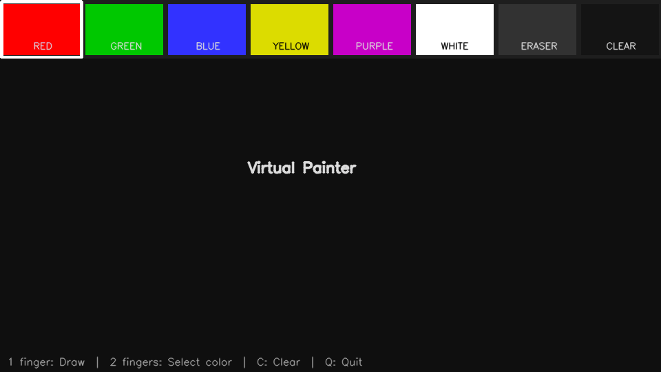

# 🎨 Virtual Painter

Real-time virtual drawing app powered by **hand gestures** and **computer vision** — no mouse, no touch, just your hand in front of a webcam.



---

## Features

- ☝️ **Draw** freely using your index finger
- ✌️ **Select colors** with a two-finger gesture over the palette
- 🧹 **Eraser** and **Clear canvas** built into the palette
- 🎨 **6 colors** — Red, Green, Blue, Yellow, Purple, White
- 🖥️ Works in real time via webcam

---

## Tech Stack

| Library | Purpose |
|---------|---------|
| [Python 3](https://python.org) | Core language |
| [OpenCV](https://opencv.org) | Video capture, drawing, rendering |
| [MediaPipe](https://ai.google.dev/edge/mediapipe/solutions/vision/hand_landmarker) | Hand tracking & 21-point landmark detection |
| [NumPy](https://numpy.org) | Image array manipulation |

---

## Installation

```bash
git clone https://github.com/andriagv/virtualPainter.git
cd virtualPainter/Desktop/py
pip install -r requirements.txt
```

> **Note:** On macOS, use `pip3` or `pip3.14` depending on your Python version.

---

## Run

```bash
python3.14 main.py
```

On first launch, the app automatically downloads the MediaPipe hand landmark model (~8MB).

---

## Gesture Guide

| Gesture | Action |
|---------|--------|
| ☝️ Index finger up | **Draw** on canvas |
| ✌️ Index + middle fingers up | **Hover over palette** to select color |
| ✌️ Point to **ERASER** | Switch to eraser mode |
| ✌️ Point to **CLEAR** | Clear entire canvas |
| `C` key | Clear canvas |
| `Q` key | Quit |

---

## Project Structure

```
virtualPainter/
├── main.py             # Main app loop, UI, gesture logic
├── hand_tracker.py     # MediaPipe hand detection & landmark parsing
├── drawing_canvas.py   # Canvas management (draw, erase, overlay)
├── requirements.txt    # Dependencies
└── demo.gif            # Demo preview
```

---

## How It Works

1. **Webcam captures** live video frames
2. **MediaPipe** detects the hand and locates 21 landmarks in real time
3. The app checks **which fingers are raised** to determine the gesture
4. In drawing mode, it tracks the **index fingertip position** and draws lines between frames
5. The drawing is composited over the live video feed

---

## Requirements

- Python 3.10+
- Webcam
- macOS / Linux / Windows

---

## License

MIT
